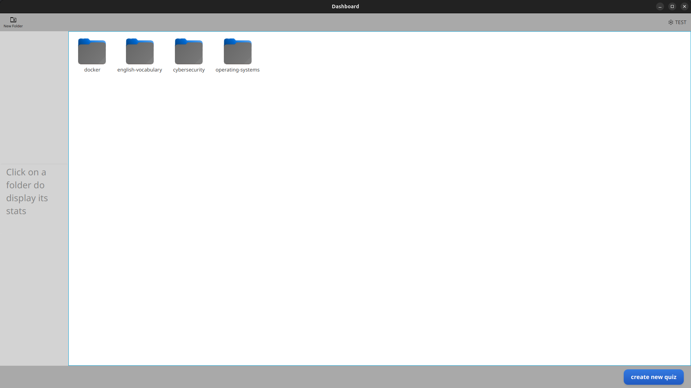

# OCR Quiz Maker  

A JavaFX application that allows users to **scan text using OCR** and automatically **generate quizzes** from the extracted content. Built with **Java 21**, **Hibernate JPA**, **SQLite**, and **Tesseract OCR**, this project was developed together with one teammate as a learning project  

---

## Features  

- **User Authentication**: Register and log in with secure password hashing.  
- **OCR Integration**: Extract text from images using Tesseract (via Tess4J).  
- **Quiz Generation**: Automatically create quizzes from scanned text with AI/Gemini API.  
- **Folder Management**: Organize questions into custom folders.  
- **Spaced Repetition**: Track review history and schedule based on difficulty.  

---

## Tech Stack  

- **Java 21**  
- **JavaFX 17** (UI)  
- **Hibernate JPA** (ORM)  
- **SQLite** (Database)  
- **Tess4J** (OCR – Tesseract binding)  
- **SLF4J** (logging)  
- **JUnit 5 / Mockito** (Testing)  

---

## UML Diagram  

---

## Screenshots  

### Login Page  
  

### 2. Register Page  
  

### 3. Database Proof (user registered with hashed password)  
  

### 4. Home Page  
  

### 5. OCR Scan Example  
  
*Extracting text from an image and generating quiz questions automatically.*  

### 6. Generated Question Stored in Cybersecurity Folder  
  
*The generated quiz question is saved in the "Cybersecurity" folder.*  

### 7. Answer Display  
  
*Shows the answer to the cybersecurity-related quiz question.*  

### 8. Folder Statistics  
  
*Clicking once on the "Cybersecurity" folder displays quick stats on the left: total number of cards, and their distribution by difficulty (easy, medium, difficult).*  

